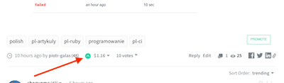
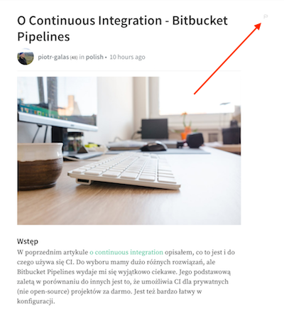
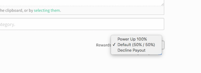

[:rocket:  strona główna](/?id=podstawowe-informacje-o-steemit)

Obliczanie wartości dodanego artykułu
======

#### Upvote

Kiedy dodajemy jakąś treść na steemit.com, inne osoby w sieci mogą na nią głosować.
Odbywa się to analogicznie jak like-owanie na Facebooku. Zamiast nazwy `like`, społeczność używa nazwy `upvote`.

<kbd>
    
</kbd>

#### Flaga

Można również dać głos ujemny, nazywany `downvote` lub `flagą`. Znajduje się ona w prawym górnym rogu artykułu.Flagi zdarzają się rzadko i zwyczajowo, jeśli komuś nie podoba się post,
to po prostu nie daje upvote.

<kbd>
 
</kbd>

#### Podział premii

Kiedy artykuł dostaje upvote-y, autor jest nagradzany odpowiednią ilością STEEM (STEEM POWER) oraz SBD.
Wartość wyrażona w SBD pojawia się na bieżąco pod postem. Przez 7 dni głosy oddawane na artykuł, zwiększają jego wartość,
później nie mają już żadnego wpływu. 75% z całej kwoty idzie do autora, natomiast pozostałe 25%,
do osób które na artykuł głosowały. 

Przy publikacji artykułu mamy trzy opcje rozliczania:

<kbd>

</kbd>

|  | Opis|
|------------------|-----|
|**Default (50% / 50%)** | Czyli 50% kwoty przeznaczonej dla autora idzie w SDB, a 50% w STEEM (STEEM POWER)|
|**Power Up 100%**|  Czyli 100% kwoty przeznaczonej dla autora idzie w STEEM(STEEM POWER)|
|**Decline Payout**|  Czyli zrzekamy się nagrody |

**Warto zwrócić uwagę, że jeśli SDB wynosi powyżej 1 USD to zdecydowanie bardziej opłaca się ustawiać 50% / 50%.**
